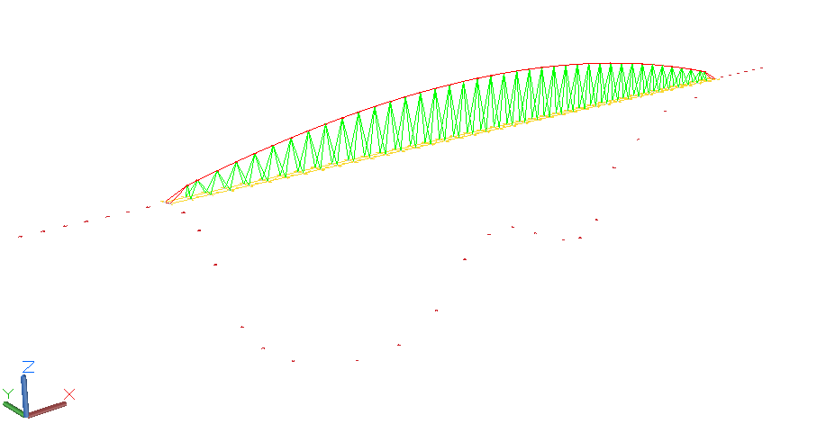

# MCOC2020_P2_G11_Entrega5

Teniendo en cuenta la restricción de que ningún tramo del tablero exceda los 6 [m] de separación, para el diseño de este, lo primero que se hizo fue dividir la luz en 40 tramos.
Al ser la luz de 215[m] la distancia entre nodos del tablero en el eje x resulto igual a 5,375 [m] (215/40). El ancho del tablero fue dado en el enunciado, es por esto que la distancia entre nodos del tablero en el eje y es igual a 2 [m].

A continuacion se busco una geometría lo más optima posible. La primera solución planteada fue la utilización de un arco en forma de catenaria invertida que pase por tres puntos, el punto inicial fue el punto 7 y el punto final el punto 28 (como se especifica en el enunciado), el punto medio del arco se planteo en z = 115[m]. Es importante mencionar que al hacer los rediseños, se cambiaron tanto las propiedades de cada barra como la flecha del arco. 

El diseño preliminar se puede apreciar en la siguente imagen:

  

Las propiedades para todas las barras en primera instancia fueron las siguentes: 

- A = (1.1*cm)**2
- r = sqrt(A/3.141593)
- props = [r, r, 200*GPa, 7600*kg/m**3, 420*MPa]

Las iteraciones se pueden ver en la siguiente tabla:

Iteración	|Fecha máx. arco  z [m]|	Peso|	Comentario
| :-------: | :-----------: |:-----------: | :-----------: |
|1|	115	|22485          |	NO CUMPLE EL DISEÑO - Todas las areas en 1.1 |
|2|	115	|76366          |	CUMPLE DISEÑO|
|3|   115	|79433          |	CUMPLE DISEÑO|
|4|	120	|109235         |	CUMPLE DISEÑO|
|5|	112	|69409          |	CUMPLE DISEÑO|
|6|	110	|67113          |	CUMPLE DISEÑO|
|7|	108	|70058          |	CUMPLE DISEÑO|
|8|	106	|80722          |	CUMPLE DISEÑO|
|9|	125	|151166         |	CUMPLE DISEÑO|
|10|	111	|67794          |	CUMPLE DISEÑO|

   
De la tabla se desprende que el optimo (menor peso) se obtiene en la iteración número 6. 
Los nodos y las propiedades de todas las barras para lograr ese mínimo se encuentran en los archivos caso_D.py y caso_L.py en los que también se definen los casos de análisis.
 
