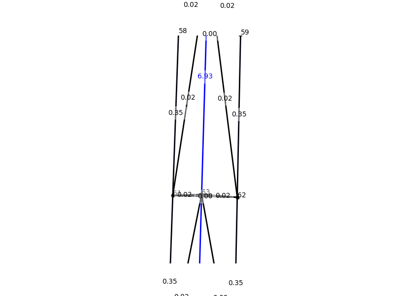
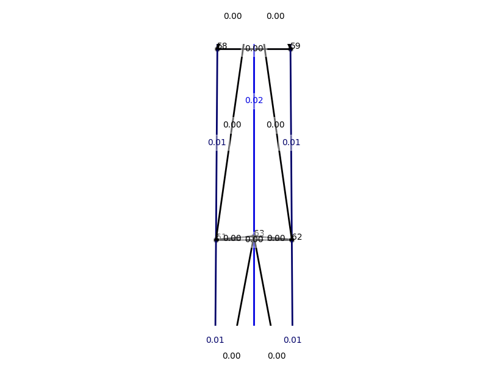
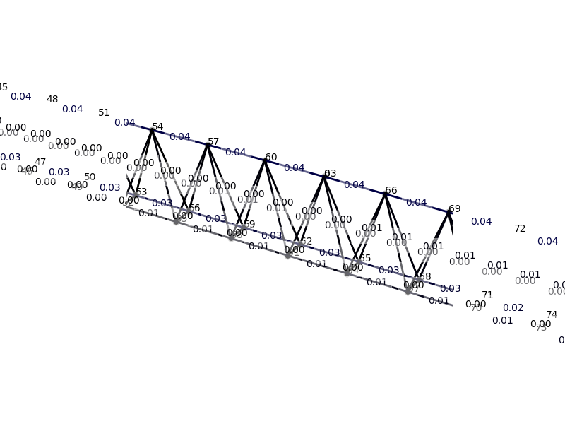
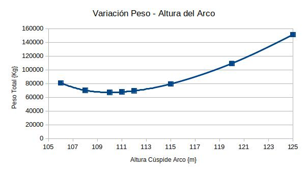

# MCOC2020_P2_G11_Entrega5

Teniendo en cuenta la restricción de que ningún tramo del tablero exceda los 6 [m] de separación, para el diseño de este, lo primero que se hizo fue dividir la luz en 40 tramos.
Al ser la luz de 215[m] la distancia entre nodos del tablero en el eje x resulto igual a 5,375 [m] (215/40). El ancho del tablero fue dado en el enunciado, es por esto que la distancia entre nodos del tablero en el eje y es igual a 2 [m].

A continuación se buscó una geometría lo más optima posible. La primera solución planteada fue la utilización de un arco en forma de catenaria invertida que pase por tres puntos, el punto inicial (punto 7), el punto final (punto 28) y el punto medio del arco (x= 117,5 [m]; y = 1[m]; z = 115[m]). Es importante mencionar que al hacer los rediseños, se optimizaron tanto las propiedades de cada barra como la flecha máxima del arco. 

El diseño preliminar se puede apreciar en la siguente imagen:

  

Las propiedades para todas las barras en primera instancia fueron las siguentes: 

- A = (1.1*cm)**2
- r = sqrt(A/3.141593)
- props = [r, r, 200*GPa, 7600*kg/m**3, 420*MPa]

Las iteraciones se pueden ver en la siguiente tabla:

Iteración	|Fecha máx. arco  z [m]|	Peso|	Comentario
| :-------: | :-----------: |:-----------: | :-----------: |
|1|	115	|22485          |	NO CUMPLE EL DISEÑO - Todas las areas en 1.1 |
|2|	115	|76366          |	CUMPLE DISEÑO|
|3|   115	|79433          |	CUMPLE DISEÑO|
|4|	120	|109235         |	CUMPLE DISEÑO|
|5|	112	|69409          |	CUMPLE DISEÑO|
|6|	110	|67113          |	CUMPLE DISEÑO|
|7|	108	|70058          |	CUMPLE DISEÑO|
|8|	106	|80722          |	CUMPLE DISEÑO|
|9|	125	|151166         |	CUMPLE DISEÑO|
|10|	111	|67794          |	CUMPLE DISEÑO|

   
De la tabla se desprende que el optimo (menor peso) se obtiene en la iteración número 6. 
Los nodos y las propiedades de todas las barras para lograr ese mínimo se encuentran en los archivos caso_D.py y caso_L.py en los que también se definen los casos de análisis.

En la siguinete imágen se presentan los factores de utilización para la iteracion 1 (NO CUMPLE EL DISEÑO):
 
  
 
Como se puede ver en la imágen hay valores para los factores de utilización mayores a 1.
 
A continuación se presenta una imagen donde se ven los factores de utilización despues del primer rediseño (CUMPLE DISEÑO) donde solo se cambiaron las propiedades de las barras pero la geometría del puente permanece constante:

En este caso se puede ver como los valores de los factores de utilización ya no sobrepasan el uno. Hay que tener en consideración que la respuesta aún no es la optima.

Como se dijo anteriormente el minimo se encontro en la iteración 6 y acontinuación se presenta una imagen con algunos de sus factores de utilización:

RESULTADOS FINALES:

Se ha optimizado el puente en dos etapas en forma paralela. Partiendo de una geometría inicial, se han adoptaco areas de 1,1 cm2 para todas las barras y se ha realizado la optimización de las caracteristicas geometricas de las barras. Para este proposito ha sido necesario iterar de 2 a 3 veces hasta obtener que los esfuerzos internos sean satisfactoramente resistidos. Esta iteración surge del modelo hiperestatico de la estructura elegida. 

En segunda instancia se ha iterado con la altura total del arco. Para cada variación de altura se ha efectuado la optimización de las caracteristicas geométricas hasta llegar a la condición de diseño.

En el gráfico siguiente se presentan los resultados:

